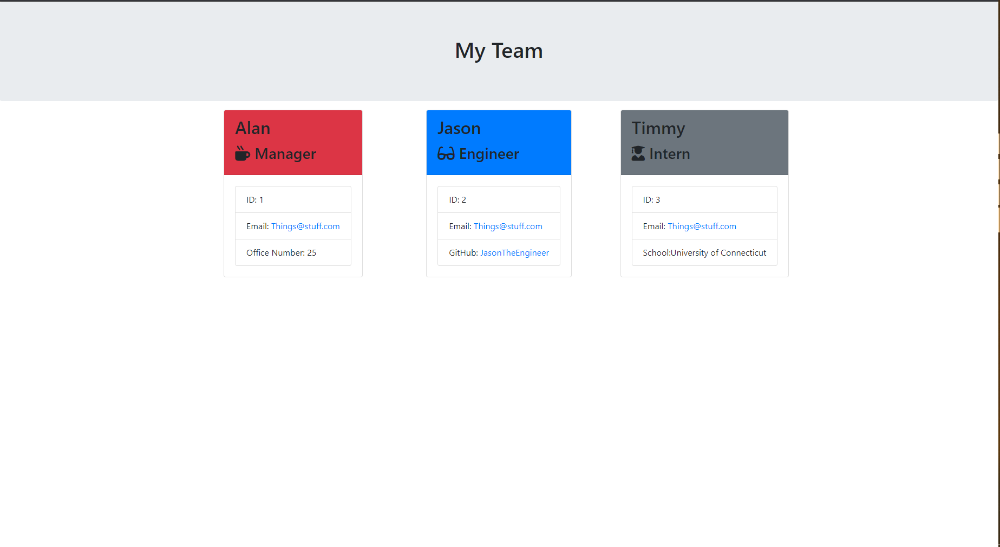

# EmployeeSummaryTemplate

### Table of Contents

  * [Description](#description)
  * [Installation](#installation)
  * [Usage](#usage)
  * [License](#license)
 
## Description 
 
 
This porject can be used to generate a team page for a project, including special classes for the project manager, engineer, or intern. This is a command line application using Node.js to generate an html file using minimal input from the project author. teamPage.html was generated using the application.
      
## Installation
      
First run npm install to install the package dependencies that this program requires. Then use the command 'node app.js' to run the application.
      
## Usage 

      
When run, the application will prompt you for details about your project team to populate the webpage with. It will then generate a file using those responses.
      
## License
      
MIT License

---
    
## Questions?
   
GitHub: [@MichaelMayor](https://api.github.com/users/MichaelMayor)
